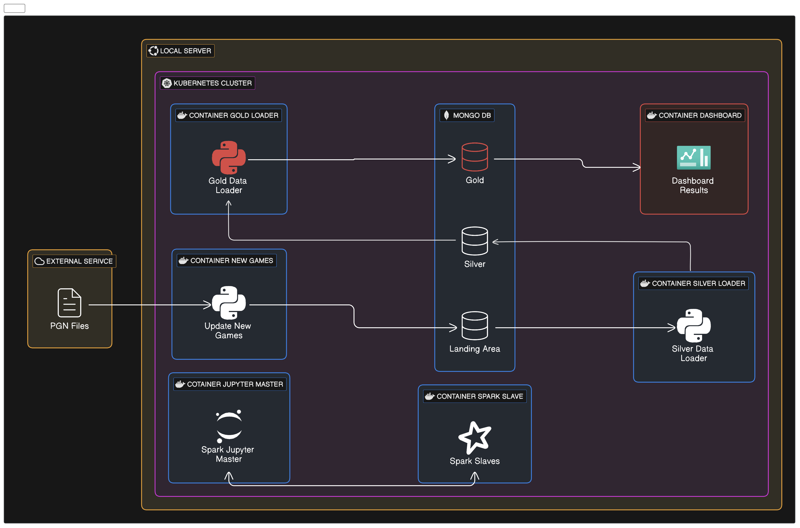

# Introduction

This project aims to analyze one of the Chess most famous tournaments: Titled Tuesday. It happens weekly and on an early and late edition, meaning we can see a lot of very high level play every week, and with today's popularity of streaming we get a constant glimpse of the top players reason for the moves.

I'll answer question such as: who's the most successful player, what was the biggest upset, how advantageous is to play as white, where do players spend most of their time, when do players make the most blunders, has the level increased over time, among others.
This project aims to sharpen my skills in the whole data field, that means I'll be using the following technologies:

* Python (Pandas, Numpy, Seaborn, etc)
* Docker for containerization
* Kubernetes for container and services orchestration
* Minikube for local Kubernetes development
* MongoDB as Database (NoSQL)

The aim is to develop a full service using micro services (containers) with very specific goals, like holding the Database, loading data new data, transforming data, displaying the data, etc.

## Project structure

The diagram below show the project structure consisting of many microservices container for the ETL process and a NoSQL Mongo Database.

Included in this project is a Jupyter Container that creates Spark Slaves and loads the data from the MongoDB container, this was not utilized in the data exploration.

# Requirements

## Docker CE

## Minikube
